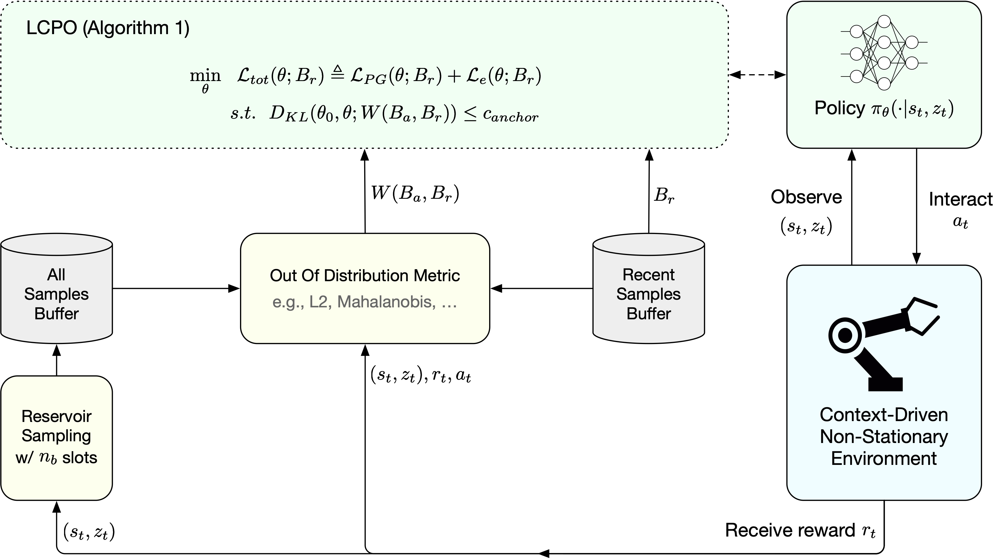
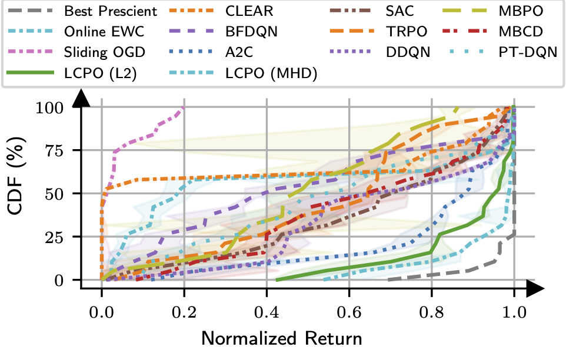
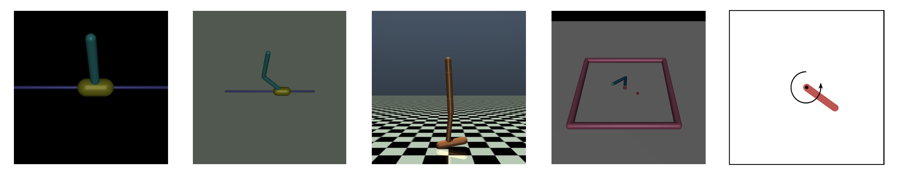
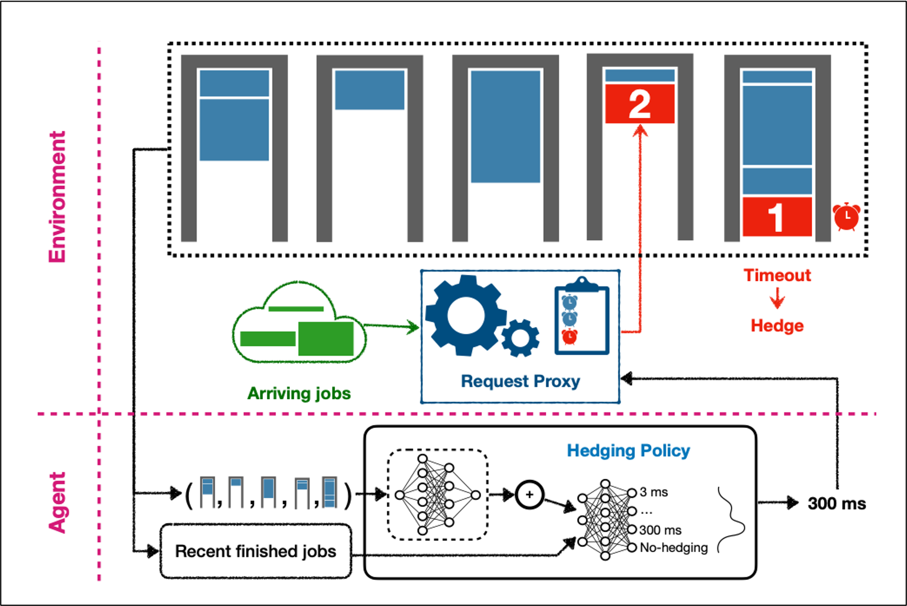

# Locally Constrained Policy Optimization (LCPO): Online Reinforcement Learning in Non-stationary Context-Driven Environments

## Overview

LCPO is an online reinforcement learning algorithm tailored for non-stationary context-driven environments. The repository provides implementations and experiments to advance the understanding and performance of agents operating under these challenging conditions.

<p align="center"> </p>


## Reproducing Evaluations

There are four self-contained benchmarks used in the paper. To reproduce the results in the paper, you can follow instructions for each benchmark:

- **[Windy-Gym Environments](windy-gym/README.md)**: A suite of environments based on Gymnasium and MuJoCo tasks that have been customized to include stochastic wind effects.

<p align="center"></p>

- **[Straggler Mitigation](straggler_mitigate/README.md)**: A load balancing problem, where the goal is to minimize latency by sending duplicate requests to multiple servers and using the fastest response.

<p align="center"></p>

- **[Grid World](toy_grid_world/README.md)**: A simple grid-based environment to used to showcase the intuition behind LCPO.

<p align="center">   </p>

- **[Discrete Gym Environments](disc-gym/README.md)**: Gymnasium and MuJoCo environments, but continuous action spaces are replaced with discretized versions. This benchmark shows that this discretization doesn't have any effect on how well RL algorithms can learn the original environment.

<p align="center"></p>

## Installation

To set up the LCPO project on your local machine:

1. **Clone the Repository**:

   ```bash
   git clone https://github.com/pouyahmdn/LCPO.git
   ```

2. **Navigate to the Project Directory**:

   ```bash
   cd LCPO
   ```

3. **Install Dependencies**:

   We use Python (3.8 tested) for all experiments. Install PyTorch according to the website [instructions](https://pytorch.org). Install the remaining required packages via `pip` (or `conda`):

   ```bash
   pip install -r requirements.txt
   ```

## License

This project is licensed under the [MIT License](LICENSE). You are free to use, modify, and distribute this software in accordance with the license terms.

## Citation

If you use LCPO for your research, please cite our [paper](https://openreview.net/pdf?id=l6QnSQizmN):

```bibtex
@inproceedings{
   hamadanian2025online,
   title={Online Reinforcement Learning in Non-Stationary Context-Driven Environments},
   author={Pouya Hamadanian and Arash Nasr-Esfahany and Malte Schwarzkopf and Siddhartha Sen and Mohammad Alizadeh},
   booktitle={The Thirteenth International Conference on Learning Representations},
   year={2025},
   url={https://openreview.net/forum?id=l6QnSQizmN}
}
```

## Contact

For questions, suggestions, or collaborations, please open an issue or contact the maintainer directly through GitHub.
